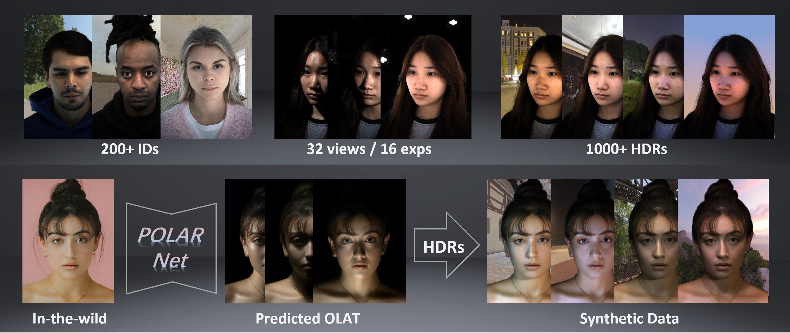

<h2 align="center"<strong>POLAR: A Portrait OLAT Dataset and Generative Framework for Illumination-Aware Face Modeling</strong></h2>
  <p align="center">
    Zhuo Chen<sup>1,2&#x2020;</sup>,</span>
    ·
    <a href='https://rex0191.github.io/' target='_blank'>Chengqun Yang</a><sup>1&#x2020;</sup>
    ·
    <a href="https://suzhuo.github.io/" target='_blank'>Zhuo Su</a><sup>2*</sup>
    ·
    <a href="https://g-1nonly.github.io/" target='_blank'>Jingnan Gao</a><sup>1</sup>
    ·
    Xiaoyuan Zhang<sup>2</sup>
    ·
    <a href="https://scholar.google.com/citations?user=yDEavdMAAAAJ&hl=zh-CN" target='_blank'>Xiaokang Yang</a><sup>1</sup>
    ·
    <a href="https://daodaofr.github.io/" target='_blank'>Yichao Yan</a><sup>1*</sup>
    <br>
    <sup>1</sup>MoE Key Lab of Artificial Intelligence, Shanghai Jiao Tong University  <sup>2</sup>PICO  
    <br>
    <strong>CVPR 2026 (Oral)</strong>
    
  </p>
</p>
<p align="center">
  <a href='https://arxiv.org/abs/2512.13192'>
    </a>
  <a href='https://openaccess.thecvf.com/content/CVPR2026/papers/Chen_POLAR_A_Portrait_OLAT_Dataset_and_Generative_Framework_for_Illumination-Aware_CVPR_2026_paper.pdf'>
    </a>
  <a href='https://rex0191.github.io/POLAR/'>
    </a>
  <a href='https://github.com/Rex0191/POLARNet/blob/main/OLAT_data_processing/README.md#POLAR-Dataset-Download'>
    </a>
</p>




# POLARNet

Official implementation of **POLARNet**, a generative portrait relighting framework built on the POLAR OLAT representation.

POLARNet predicts direction-aware OLAT lighting responses from a portrait image and enables realistic portrait relighting under novel illumination. This repository contains the source code, configuration files, and example scripts for environment setup, training, and inference.

> **Note**
> Pretrained checkpoints are not bundled with this repository. Checkpoint distribution details will be added in a later update.


## 🧪 Data Processing

For OLAT data preparation, preprocessing, and intermediate asset generation, please see the dedicated guide:

**[Go to the OLAT Data Processing README](./OLAT_data_processing/README.md)**

That document covers the full processing workflow, required inputs, and step-by-step usage instructions.

---

## 📢 News

- Codebase released.
- Pretrained checkpoint release information will be added later.

---

## ✅ TODO

- [ ] Release pretrained POLARNet checkpoints.
- [ ] Add more detailed inference instructions.
- [ ] Provide example input/output visualizations.
- [ ] Expand dataset preparation documentation.

---

## 📁 Repository Structure

```text
.
├── configs/                     # Configuration files
├── scripts/                     # Training and inference scripts
├── src/                         # Core implementation
├── requirements.txt             # Python dependencies
└── README.md
```

Some large or machine-specific assets are intentionally excluded from version control.

---

## 🤖 Model Dependencies

Some third-party model assets required by the pipeline are not stored in this repository.
They will be downloaded automatically the first time you run the relevant script.

No manual Hugging Face cache setup is required in the README. If your environment has custom cache or storage requirements, you may still configure them locally as needed.

---

## 📥 Checkpoints

Download the pretrained OLAT checkpoint from the link below and place it in the following directory:

```text
POLARNet/examples/inference/ckpts/olat/
```

Checkpoint download link:

- `YOUR_CHECKPOINT_DOWNLOAD_LINK_HERE`

After downloading, ensure that the checkpoint file is stored under `POLARNet/examples/inference/ckpts/olat/`. If this directory does not exist, create it manually before running inference.

If your local script or configuration expects a specific checkpoint filename, please keep the filename consistent or update the path in the corresponding script.

---

## 🛠️ Environment Setup

We recommend creating a dedicated Conda environment:

```bash
conda create -n polarnet python=3.10 -y
conda activate polarnet

pip install -r requirements.txt
pip install -e .
```

If your setup requires a specific CUDA or PyTorch build, install the matching PyTorch version first, then install the remaining dependencies.

---

## 📌 Preparing Local Paths

Before running training or inference, make sure the following paths are configured correctly in your scripts or configs:

1. checkpoint path;
2. dataset path;
3. input directories;
4. output directories.

---

## 🚀 Usage

This repository provides the main code and script entry points for POLARNet. Please inspect the included shell scripts and configuration files to match them with your local environment.

For example:

```bash
cd examples/inference/olat/
bash olatlight.sh
```

Before running a script, confirm that:

1. the Python environment has been installed successfully;
2. required checkpoints are available locally;
3. dataset and input paths are set properly;
4. output paths are configured as expected.

---

## 📚 Citation

If you find this repository useful, please consider citing our work.

```bibtex
@InProceedings{Chen_2026_CVPR,
    author    = {Chen, Zhuo and Yang, Chengqun and Su, Zhuo and Lv, Zheng and Gao, Jingnan and Zhang, Xiaoyuan and Yang, Xiaokang and Yan, Yichao},
    title     = {POLAR: A Portrait OLAT Dataset and Generative Framework for Illumination-Aware Face Modeling},
    booktitle = {Proceedings of the IEEE/CVF Conference on Computer Vision and Pattern Recognition (CVPR)},
    month     = {June},
    year      = {2026},
    pages     = {28871-28881}
}
```

---

